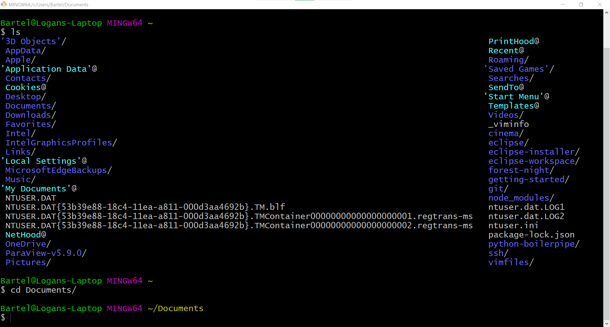

# Git-beginners-guide

## Note: Click the icon circled in red to access the table of contents.


## Introduction

## What is Git?
Git is a version control platform.  The main benefit of using Git is to track changes to a repository.

The changes that are tracked include the following:
* What changes were made
* When they were made
* Who made the changes

There are many different interfaces of Git.
A few interfaces that come to mind are:
* GitHub
* GitLab
* Gitea
* Command-Line

This guide will only focus on 2 interfaces:
* GitHub
* Command-Line

## What You'll Need

### Basic Command-Line Knowledge

The command-line is just a text version of what you see in the file explorer.  Commands are just you telling the interface what you want to see or where you want to go.

**For Mac Users:**

Click the magnifying glass in the top-right of your screen and type ```terminal```.

Click on ```Terminal.app```.

This will bring up your terminal.

**For Windows Users \(like me\):**

While you *can* use your ```cmd``` or ```Powershell``` applications, you should avoid using them like the plague.
This is because some commands differ between Windows and Mac.  Mac OS behaves more like Linux, a separate operationg system from Windows and Mac.

Believe me when I say, you want a more Linux-like experience.
In order to get that, there are several options to choose from.
I will only recommned 2 to keep it simple.
* [git for windows/Git Bash](https://gitforwindows.org/) - **Pick this one!**
  * Will be used in this guide.
  * Easier to install/set up.
* [Cygwin](https://www.cygwin.com/) 
  * More complex.
  * Many things to configure when installing.

In order to be efficient with Git, you need to get used to using the command line.

Commands are executed by typing them in the terminal and pressing the Enter key.

Basic commands not exclusive to Git include the following:
* ```pwd```
  * This is the "print work directory" command.  It tells you where you are in your file system/prints your current directory.
* ```ls```
  * This is the "list" command.
  * It lists all the files and directories in your current directory.
* ```cd```
  * This is the "change directory" command.  A directory is the same thing as a folder.
  * You'll use it whenever you want to go to a certian directory.
  * If you want to go to your "Documents" directory: ```cd Documents/```.
  * **Special note 1: Use Tab!** For example, typing ```cd Docu``` and then pressing your Tab key will autocomplete the word "Documents".
  * **Special note 2:** Whatever you try to autocomplete with Tab must already exist!  The directory you're trying to change to must also already exist.
* ```mkdir```
  * This is the "make directory" command.  It makes a new directory in your current directory.
  * If you want to make a new directory called "images": ```mkdir images```.
* ```clear```
  * This command clears your terminal.
  
There are a few more, like ```cp``` \(copy\), ```mv``` \(move\) and ```rm``` \(remove\), but you should wait to learn those until you've gotten used to the previous 5 commands.
 
### Example Walkthrough
I'll walk you through an example of the commands mentioned above.
 
We're going to navigate to the directory containing this file, the one you're currently reading, on the command-line.

Where we're going is shown below in the Windows File Explorer.


 
Let's start by opening Git Bash.
 
**Note: Your terminal will always open to the same directory, your home directory.**
 

 
Where are we?  Let's find out using ```pwd```
 

 
Well, it spits out ```/c/Users/Bartel```, and I'm still not sure where we are...
 
So let's try ```ls```
 

 
Note that anything with a ```/``` on the end is a directory.
 
Hey, I recognize "Documents/"! Let's go there!
 
```cd Documents/``` **Note: I typed ```cd Docu``` and pressed Tab to autocomplete "Documents/"**
 

 
So what's here?  Let's do ```ls``` again.
 
For anonymity purposes, I'm going to use a variation of the ```ls``` command to list only directories here.
 
```ls -l | grep ^d``` produces what you see below.
 

 
The ```d``` at the beginning of each line means "directory".  Remember that a ```/``` at the very end of each line also denotes a directory.
Dont' worry too much about what's in between right now.  Only focus on the final column with the directory names.
 
I know this file is in "EN307/", so let's to go there.
But before I do, I feel like my terminal is a bit crowded, so I'm going to type ```clear``` and press Enter to clear my terminal.

I'm going to do both ```cd EN307/``` and ```ls -l | grep ^d``` before this next screenshot.
 
**Note: You can use the up arrow on your arrow keys to cycle through past commands so you don't have to retype them.**


 
Only 1 directory this time!  Let's go there and do an ```ls```!
 
```cd Git-beginners-guide/```
 
```ls```
 
The result of both commands:
 

 
Hey, there it is!  "README.md"!  That's the name of this file!  We did it!
 
### Main Takeaways

* If you know where you're going, **you can do the entire example above with just 1 command!**
  * That command is ```cd Documents/EN307/Git-beginners-guide/```
* If you get lost, back up or go home!
  * You can use ```cd ..``` to back up 1 directory, ```cd ../..``` to back up 2 directories, etc.
  * You can also use ```cd ~``` to go to your home directory.  Your home directory is the directory that your terminal will always open to.  ```~``` denotes your home directory, or in my case, ```/c/Users/Bartel```.
  
### Text Editors

Using a text editor is the easiest way to make any file you want.

Here are the editors I have experience with and would recommned, with screenshots of their interfaces:
* Vim
  * **Warning! Steep Learning curve!** While Vim is very powerful, I would recommned avoiding it for now, but learning it eventually.
  * This editor is accessed at the command line with the ```vim``` command.
  * Type the name of the file after ```vim``` for the file that you want to make or edit.  Example: ```vim test.txt```.
  * If you're using it for the first time, type ```vimtutor``` into your terminal and press Enter to get a tutorial.
  * Below is a screenshot of this file opened in Vim.
  


* [Sublime Text](https://www.sublimetext.com/)
  * A very nice text editor with little-to-no learning curve.
  * Available on Mac and Windows.
  * Below is a screenshot of this file opened in Sublime Text.
  


* [Notepad++](https://notepad-plus-plus.org/)
  * A very nice text editor with little-to-no learning curve.
  * **Only available for Windows!**
  * Below is a screenshot of this file opened in Notepad++.
  


* [Visual Studio Code](https://code.visualstudio.com/)
  * A robust editor with a small-to-medium learning curve.
  * You can integrate your terminal!
  * Available for Mac and Windows.
  * Below is a screenshot of this file opened in Visual Studio Code.
  

 
## Starting With GitHub

## Making Changes

## Other Things

## Markdown