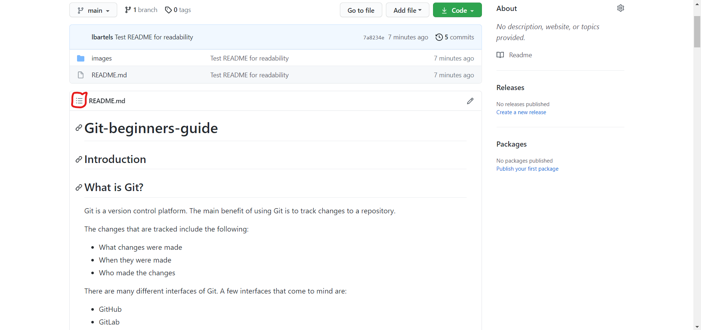

# Git Beginner's Guide

## Note: Click the icon circled in red to access the table of contents.



## Introduction

Hi!  Welcome to my Git Beginner's Guide!  I'm going to assume you have absolutely no experience with Git or the command line.  Let's get started!

## What is Git?
Git is a version control platform.  The main benefit of using Git is to track changes to a repository.

The changes that are tracked include the following:
* What changes were made
* When they were made
* Who made the changes

There are many different interfaces of Git.
A few interfaces that come to mind are:
* GitHub
* GitLab
* Gitea
* Command-Line

This guide will only focus on 2 interfaces:
* GitHub
* Command-Line

## What You'll Need

### Basic Command-Line Knowledge

The command-line is just a text version of what you see in the file explorer.  Commands are just you telling the interface what you want to see or where you want to go.

**For Mac Users:**

* Click the magnifying glass in the top-right of your screen and type ```terminal```.

* Click on ```Terminal.app```.

* This will bring up your terminal.

**Mac users must update their version of Git!**

* While Git comes pre-installed on Macs, it's most likely out-of-date.

* To do this, paste this command into your terminal and press Enter: ```/bin/bash -c "$(curl -fsSL https://raw.githubusercontent.com/Homebrew/install/HEAD/install.sh)"```

* This will install Homebrew.

* Now update Homebrew by typing ```brew update``` and press Enter.

* Then type ```brew install git```.

* Check to make sure you have an up-to-date version of Git by typing ```git --version``` and pressing Enter.

The latest Git version at the time of writing is 2.31.1.

**For Windows Users \(like me\):**

While you *can* use your ```cmd``` or ```Powershell``` applications, you should avoid using them like the plague.
This is because some commands differ between Windows and Mac.  Mac OS behaves more like Linux, a separate operating system from Windows and Mac.

Believe me when I say, you want a more Linux-like experience.
In order to get that, there are several options to choose from.
I will only recommned 2 to keep it simple.
* [git for windows/Git Bash](https://gitforwindows.org/) - **Pick this one!**
  * Will be used in this guide.
  * Easier to install/set up.
* [Cygwin](https://www.cygwin.com/) 
  * More complex.
  * Many things to configure when installing.

In order to be efficient with Git, you need to get used to using the command line.

Commands are executed by typing them in the terminal and pressing the Enter key.

Basic commands not exclusive to Git include the following:
* ```pwd```
  * This is the "print work directory" command.  It tells you where you are in your file system/prints your current directory.
* ```ls```
  * This is the "list" command.
  * It lists all the files and directories in your current directory.
* ```cd```
  * This is the "change directory" command.  A directory is the same thing as a folder.
  * You'll use it whenever you want to go to a certian directory.
  * If you want to go to your "Documents" directory: ```cd Documents/```.
  * **Special note 1: Use Tab!** For example, typing ```cd Docu``` and then pressing your Tab key will autocomplete the word "Documents".
  * **Special note 2:** Whatever you try to autocomplete with Tab must already exist!  The directory you're trying to change to must also already exist.
* ```mkdir```
  * This is the "make directory" command.  It makes a new directory in your current directory.
  * If you want to make a new directory called "images": ```mkdir images```.
* ```clear```
  * This command clears your terminal.
  
There are a few more, like ```cp``` \(copy\), ```mv``` \(move\) and ```rm``` \(remove\), but you should wait to learn those until you've gotten used to the previous 5 commands.
 
### Example Walkthrough
I'll walk you through an example of the commands mentioned above.
We're going to navigate to the directory containing this file, the one you're currently reading, on the command-line.
Where we're going is shown below in the Windows File Explorer.


 
Let's start by opening Git Bash.
 
**Note: Your terminal will always open to the same directory, your home directory.**
 

 
Where are we?  Let's find out using ```pwd```
 

 
Well, it spits out ```/c/Users/Bartel```, and I'm still not sure where we are...
 
So let's try ```ls```
 

 
Note that anything with a ```/``` on the end is a directory.
 
Hey, I recognize "Documents/"! Let's go there!
 
```cd Documents/``` **Note: I typed ```cd Docu``` and pressed Tab to autocomplete "Documents/"**
 

 
So what's here?  Let's do ```ls``` again.
 
For anonymity purposes, I'm going to use a variation of the ```ls``` command to list only directories here.
 
```ls -l | grep ^d``` produces what you see below.
 

 
The ```d``` at the beginning of each line means "directory".  Remember that a ```/``` at the very end of each line also denotes a directory.
Dont' worry too much about what's in between right now.  Only focus on the final column with the directory names.
 
I know this file is in "EN307/", so let's to go there.
But before I do, I feel like my terminal is a bit crowded, so I'm going to type ```clear``` and press Enter to clear my terminal.

I'm going to do both ```cd EN307/``` and ```ls -l | grep ^d``` before this next screenshot.
 
**Note: You can use the up arrow on your arrow keys to cycle through past commands so you don't have to retype them.**


 
Only 1 directory this time!  Let's go there and do an ```ls```!
 
```cd Git-beginners-guide/```
 
```ls```
 
The result of both commands:
 

 
Hey, there it is!  "README.md"!  That's the name of this file!  We did it!
 
### Main Takeaways

* If you know where you're going, **you can do the entire example above with just 1 command!**
  * That command is ```cd Documents/EN307/Git-beginners-guide/```
* If you get lost, back up or go home!
  * You can use ```cd ..``` to back up 1 directory, ```cd ../..``` to back up 2 directories, etc.
  * You can also use ```cd ~``` to go to your home directory.  Your home directory is the directory that your terminal will always open to.  ```~``` denotes your home directory, or in my case, ```/c/Users/Bartel```.
  
### Text Editors

Using a text editor is the easiest way to make any file you want.
Here are the editors I have experience with and would recommend. I have also included screenshots of their interfaces:
* Vim
  * **Warning! Steep Learning curve!** While Vim is very powerful, I would recommned avoiding it for now, but learning it eventually.
  * This editor is accessed at the command line with the ```vim``` command.
  * If you're using it for the first time, type ```vimtutor``` into your terminal and press Enter to get a tutorial.
  * Type the name of the file after ```vim``` for the file that you want to make or edit.  Example: ```vim test.txt```.
  * Below is a screenshot of this file opened in Vim.
  


* [Sublime Text](https://www.sublimetext.com/)
  * A very nice text editor with little-to-no learning curve.
  * Available on Mac and Windows.
  * Below is a screenshot of this file opened in Sublime Text.
  


* [Notepad++](https://notepad-plus-plus.org/)
  * A very nice text editor with little-to-no learning curve.
  * **Only available for Windows!**
  * Below is a screenshot of this file opened in Notepad++.
  


* [Visual Studio Code](https://code.visualstudio.com/)
  * A robust editor with a small-to-medium learning curve.
  * You can integrate your terminal!
  * Available for Mac and Windows.
  * Below is a screenshot of this file opened in Visual Studio Code.
  

 
## Starting With GitHub

### Making an Account

If you don't already have a GitHub account, go to [github.com](https://github.com/) and make one.

### Making a Repository

After you've made you account or signed in, you should see this page:


Click the ```+``` icon in the top-right corner of the screen and select ```New Repository```.
The one thing you *must* do here is check the box that says ```Add a README file```.  README files serve as documentation for what's in your repository.  It's good practice to always have a README file in your repository.  GitHub will automatically display the README file for you.

After you've created your repository, your screen should look like this:


Make note of the green ```Code``` button for later.

### Cloning a Repository

Before you clone your repository, you should generate a pair of SSH keys.
GitHub has an excellent [SSH key guide](https://docs.github.com/en/github/authenticating-to-github/generating-a-new-ssh-key-and-adding-it-to-the-ssh-agent).
When you get to step 3 of "Generating a new SSH key", just use the default file name.  When you get to step 4 of "Generating a new SSH key", **use a passphrase**.

Once you have your SSH key set up and added to your GitHub account, go back to your repository and click the green ```Code``` button.

Be sure to select ```SSH``` like I did below, and click the clipboard icon to copy the URL to your clipboard.


Go back to Git Bash and ```cd``` into whatever directory you want to clone your repository into.

Then type ```git clone``` and paste your copied URL after ```clone```.

Example: ```git clone git@github.com:Razor308/Test-Repo.git```

You should be prompted for your key passphrase, but then you're ready to make changes!

## Making Changes

Open your terminal or Git Bash and ```cd``` into you newly cloned repository. 

Open your text editor of choice and make a new file called ```test.txt```.  Put any text you want in the file and save it.

### Pushing Your Changes

In order to push \(upload\) your changes to your remote repository, you need to learn some ```git``` commands:

* ```git status```
  * Tells you if your local repository is ahead or behind your remote repository.
  * Shows you tracked, untracked, and modified files.
* ```git add```
  * Tracks files and changes made to them.
* ```git commit```
  * Commits tracked changes to your local repository.
* ```git push```
  * Pushes your committed changes to your remote repository.
  
### Example

Assuming you made ```test.txt``` and put some sample-text inside of it, we're going to push ```test.txt``` to the remote repository.

Starting with ```git status``` shows that ```test.txt``` is untracked and has to be added.


Let's add the file with ```git add test.txt```

And check the status again with ```git status```.


```test.txt``` is ready to be committed!

Let's commit the change with ```git commit -m "Add test.txt"```

**Note: Always write a meaningful commit message!**

Now time to push our changes with ```git push origin main```

**You should be prompted for your key passphrase here.**

Now go to your repository on GitHub and refresh the page.  You should see you new file.


Try clicking on it!  You should see what you wrote.

Congratulations!  You know how to use Git and GitHub!

## Other Things

### Branches

You can make multiple branches of a repository using ```git branch```.

Just ```cd``` into your local repository and execute the ```git branch``` command.

For example:  I would ```cd``` into my repository and type ```git branch test-branch``` to make a branch called ```test-branch```.

**Make sure you switch to your new branch!**

You can switch between branches using ```git checkout```.  
So I would switch to my new test branch using ```git checkout test-branch```.  
I would replace ```test-branch``` with ```main``` if I wanted to switch back to my main branch.

**Files can differ between branches!**

I can have files that are in my ```main``` branch that are not in my ```test-branch```, and vice versa.

You can merge branches, but that is outside the scope of this guide.

### Forks

You can fork a copy of a repository from someone else's repository.

For example, below is a screenshot of my professor's class repository that he had all his students fork using the ```Fork``` button circled in red.

We do assignments in our forked copies, and make pull requests in his repo to submit our assignments.

Unless you take his class, you probably won't need to make pull requests to the repository you forked from.


This is my forked copy of the repository


Oh, looks like my copy is behind the professor's.  See where it says "This branch is 1 commit behind phonedude:main."?

I can fix that with a few commands:

* ```git remote add upstream https://github.com/phonedude/cs595-s21.git```
  * I only had to do this command once, the first time I wanted to sync my copy with the professor's.
These next 3 commands are all I need to do now:
* ```git fetch upstream```
* ```git merge upstream/main```
* ```git push origin main```

There we go.


## Markdown

Every README file is written in Markdown, hence the ```.md``` in ```README.md```.

Markdown is pretty easy to learn.  You can mostly type normally.

But for everyting else like headings, bold, italics, images, and tables, check out [GitHub's Markdown Cheatsheet](https://guides.github.com/pdfs/markdown-cheatsheet-online.pdf).
